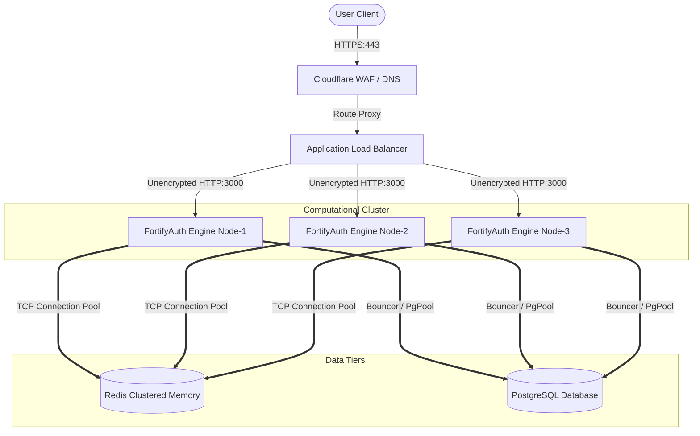
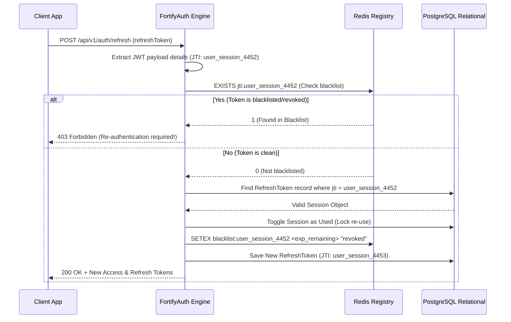

# FortifyAuth Architecture Design Specification

This document lays down the technical blueprints of FortifyAuth. It details the scale parameters, system layers, high-availability caching pipelines, background processing models, and the phased transition plan from a unified modular monolith to a microservices architecture.

---

## 1. High-Level Core System Topology

FortifyAuth is structured into four logic tiers:
1. **Public Ingress Boundary (Tier 1)**: Handles SSL/TLS termination, runs Cloudflare DDoS filtering rules, and routes API requests to the load balancer level.
2. **Computational Layer (Tier 2)**: Scalable, stateless Express.js/TypeScript application processes executing logical workflows.
3. **High-Performance Synced Memory Cache (Tier 3)**: Redis clusters storing dynamic operational values (OTPs, session blacklists, and rate IP limits).
4. **Relational System Directory (Tier 4)**: Managed PostgreSQL databases containing persistent state files (user logins, audit logs, and keys).

---

## 2. Infrastructure Flow Chart

The following Mermaid flow chart describes the active request pipelines:

---

## 3. High-Performance Caching & Redis Strategy

To satisfy enterprise SLA benchmarks (sub-millisecond lookups for tokens and low-overhead session validations), FortifyAuth uses Redis Stack v7 arranged as a clustered cache:

### 3.1 Rate Limit Buckets
* **Structure**: Sliding Window Log implemented with Sorted Sets (`ZSET`).
* **Implementation Details**: The system logs every connection timestamp with millisecond precision, utilizing `ZREMRANGEBYSCORE` to eject ancient requests and calculating the active bucket volume inside the active window. This completely blocks brute force timing vectors.

### 3.2 JTI Session Blacklist & Refresh Token Rotations
* **Structure**: Opaque string token IDs (`jti`) saved with associated Token expiration timers. 
* **Process**: When a token is rotated or invalidated, its signature `jti` is indexed in Redis with a `SETEX` command matching its JWT expiration (`exp`). During authentication, the engine queries Redis; if a match occurs, access is instantly rejected with `401 Unauthorized` without querying PostgreSQL.

---

## 4. Scalability & Horizontal Tuning Options

To scale to millions of concurrent active users, individual FortifyAuth nodes remain strictly stateless:

### 4.1 Horizontal Pod Scalers (HPA)
* **Parameters**: CPU targets are set to 70%, with memory limits set to 80%. When these numbers are breached, Kubernetes creates new computing containers.
* **Sticky Sessions**: The Load Balancers terminate SSL and run standard Round-Robin load distribution. No Sticky Sessions are required since Redis caches the central session states and JWT claims globally.

### 4.2 Database Pooling (Prisma / PgBouncer)
* **PG connection bottlenecks**: PostgreSQL limits open concurrent database connections. FortifyAuth uses **PgBouncer** in Transaction Pooling mode.
* **Benefits**: Reduces connection establishment times from ~15ms down to <1ms, shielding databases against volume spikes.

---

## 5. Background Jobs & Event-Driven Readiness

Heavy operational tasks are shifted off the thread pool to execute in background job worker threads:

### 5.1 Background Job Queue Architecture
* **Implementation**: We integrate **BullMQ** built on top of Redis. BullMQ uses Redis atomic scripts (`Lua`) to handle lock statuses across distributed worker clusters.
* **Background Tasks**:
  * Transmitting transactional emails (emails with MFA codes or password recovery tokens).
  * Building security logs inside Postgres (Audit records pipeline).
  * Syncing geo-IP coordinate data from active login tokens.

### 5.2 Microservices Integration & Pub/Sub
* **Scenario**: Whenever security elements trigger shifts (e.g. Email Changed, Password Reset, User Blocked), external downstream services (such as Billing, CRM, and SMS-Alert systems) must react.
* **Integration Patterns**: Express routers publish messages directly into **Apache Kafka** or Redis Pub/Sub channels. Downstream services capture these events and handle their business requirements without putting load on the core authentication API processes.
