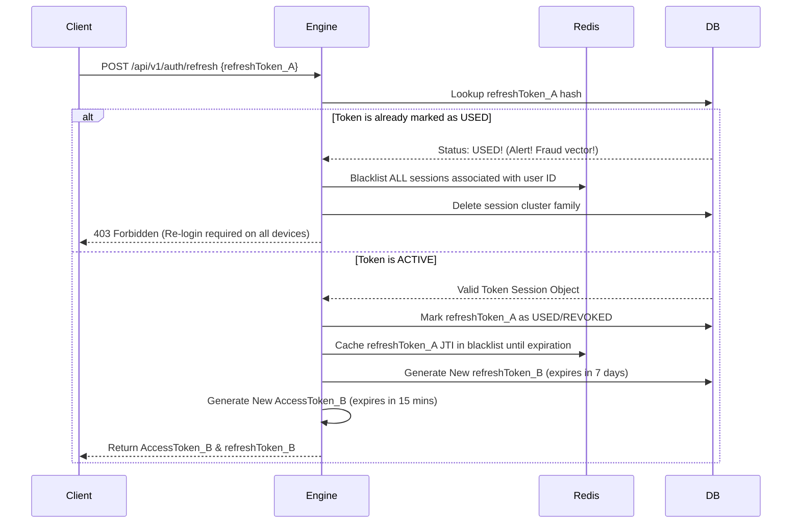

# FortifyAuth Multi-Token authentication and validation paths

FortifyAuth utilizes a robust multi-token architecture to balance user convenience with high-level security controls across web and mobile clients.

---

## 1. Dual-Token Architecture

* **Access Token**: Short lived (15 minutes). Signed with RS256. Emitted as a cryptographically signed JSON Web Token (JWT). Decoded by individual compute nodes without calling PostgreSQL.
* **Refresh Token**: Opaque cryptographically random UUID matching hashes inside PostgreSQL. Valid for 7 days. Restricted to `/api/v1/auth/refresh` paths.

---

## 2. Refresh Token Rotation (RTR) Sequence

Refresh tokens are set on a strict **Single-Use Rotation** pipeline to prevent session replay attacks if a token is intercepted:

---

## 3. Email Authentication & Activation Flow

1. Registering users receive a secure validation token inside their verified email inbox.
2. The user client sends the token back to `/api/v1/auth/verify-email`.
3. The server validates the token against the database:
   * If valid and not expired, the user's `isEmailVerified` flag is set to `true` inside PostgreSQL.
   * If expired, a new activation email can be requested via a designated endpoint.
