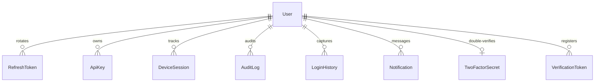

# FortifyAuth Relational Database Design & Schema

This document details the database architecture of FortifyAuth. We utilize PostgreSQL as our persistent transactional store, interacting with schemas via the **Prisma ORM engine**.

---

## 1. Schema Entity Relationship Concept

The user is the central operational entity. All other security artifacts (tokens, logs, active sessions, dynamic notifications, and API keys) are bound to the `User` table using high-performance indexing constraints and cascading rules.



---

## 2. Complete Prisma Schema Model declarations

This file defines the direct TypeScript/Prisma representation compiled into SQL tables:

```prisma
// prisma/schema.prisma

datasource db {
  provider = "postgresql"
  url      = env("DATABASE_URL")
}

generator client {
  provider = "prisma-client-js"
}

enum Role {
  USER
  ADMIN
  MODERATOR
}

model User {
  id                 String               @id @default(uuid())
  email              String               @unique
  name               String?
  passwordHash       String
  role               Role                 @default(USER)
  isEmailVerified    Boolean              @default(false)
  createdAt          DateTime             @default(now())
  updatedAt          DateTime             @updatedAt
  
  // Relations
  refreshTokens      RefreshToken[]
  apiKeys            ApiKey[]
  deviceSessions     DeviceSession[]
  auditLogs          AuditLog[]
  loginHistories     LoginHistory[]
  notifications      Notification[]
  twoFactorSecret    TwoFactorSecret?
  verificationTokens VerificationToken[]
  passwordResets     PasswordResetToken[]

  @@index([email]) // Fundamental lookup acceleration index
}

model RefreshToken {
  id           String   @id @default(uuid())
  tokenHash    String   @unique
  userId       String
  deviceFinger String?
  isUsed       Boolean  @default(false)
  isRevoked    Boolean  @default(false)
  expiresAt    DateTime
  createdAt    DateTime @default(now())

  // Relationships with automated cascading closures
  user         User     @relation(fields: [userId], references: [id], onDelete: Cascade)

  @@index([userId])
  @@index([tokenHash])
}

model VerificationToken {
  id        String   @id @default(uuid())
  token     String   @unique
  userId    String
  expiresAt DateTime
  createdAt DateTime @default(now())

  user      User     @relation(fields: [userId], references: [id], onDelete: Cascade)

  @@index([userId])
  @@index([token])
}

model PasswordResetToken {
  id        String   @id @default(uuid())
  token     String   @unique
  userId    String
  expiresAt DateTime
  createdAt DateTime @default(now())

  user      User     @relation(fields: [userId], references: [id], onDelete: Cascade)

  @@index([userId])
  @@index([token])
}

model ApiKey {
  id           String    @id @default(uuid())
  keyPrefix    String    // e.g. "fa_live_"
  keyHash      String    @unique
  name         String
  userId       String
  scopes       String[]  // e.g. ["read:users", "write:keys"]
  isActive     Boolean   @default(true)
  expiresAt    DateTime?
  lastUsedAt   DateTime?
  createdAt    DateTime  @default(now())

  user         User      @relation(fields: [userId], references: [id], onDelete: Cascade)

  @@index([userId])
  @@index([keyHash])
}

model DeviceSession {
  id           String   @id @default(uuid())
  userId       String
  deviceModel  String
  ipAddress    String
  location     String?
  userAgent    String
  isCurrent    Boolean  @default(true)
  createdAt    DateTime @default(now())
  updatedAt    DateTime @updatedAt

  user         User     @relation(fields: [userId], references: [id], onDelete: Cascade)

  @@index([userId])
}

model AuditLog {
  id         String   @id @default(uuid())
  userId     String
  action     String   // e.g. "USER_PASSWORD_CHANGE"
  ipAddress  String
  userAgent  String
  metadata   Json?    // Contextual payload detail records
  createdAt  DateTime @default(now())

  user       User     @relation(fields: [userId], references: [id], onDelete: Cascade)

  @@index([userId])
  @@index([action, createdAt]) // Composite index for quick filter lookups
}

model LoginHistory {
  id        String   @id @default(uuid())
  userId    String
  status    Boolean  // true = success, false = fail
  ipAddress String
  location  String?
  userAgent String
  createdAt DateTime @default(now())

  user      User     @relation(fields: [userId], references: [id], onDelete: Cascade)

  @@index([userId])
}

model Notification {
  id        String   @id @default(uuid())
  userId    String
  title     String
  message   String
  isRead    Boolean  @default(false)
  createdAt DateTime @default(now())

  user      User     @relation(fields: [userId], references: [id], onDelete: Cascade)

  @@index([userId])
}

model TwoFactorSecret {
  id        String   @id @default(uuid())
  userId    String   @unique
  secret    String   // Encrypted TOTP secret parameter
  backupCodes String[] // Hashed secondary rescue tokens
  isEnabled Boolean  @default(false)
  createdAt DateTime @default(now())

  user      User     @relation(fields: [userId], references: [id], onDelete: Cascade)
}
```

---

## 3. Core Database Optimizations

### 3.1 Index Mappings
We establish individual single-column and multi-column composite indices across critical search dimensions. The mapping `@@index([action, createdAt])` empowers administrators to query Millions of AuditLog records sorting by timestamp in sub-10ms intervals.

### 3.2 Cascading Closures
By explicitly binding relations with `@relation(onDelete: Cascade)`, deleting a user account cleanly sweeps and eliminates all nested dependencies (RefreshTokens, device session maps, and logs) inside PostgreSQL. This enforces GDPR security compliance rules out of the box.
