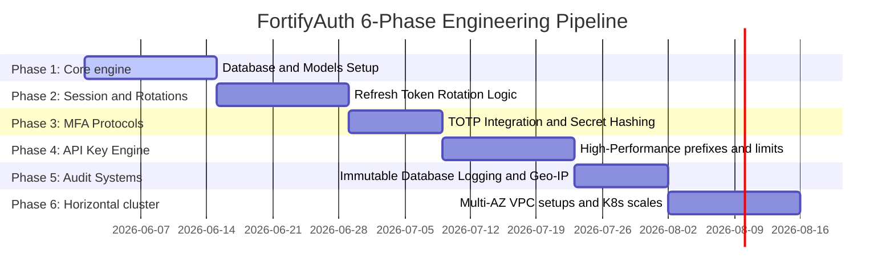

# FortifyAuth Product Roadmap

The development of FortifyAuth is separated into six progressive, structured phases. This allows engineering groups to step-by-step audit, stress-test, and sign off on security controls prior to scale expansions.

---

## Roadmap Pipelines

---

## Detailed Milestone Chapters

### Phase 1: Core Cryptographic Foundation (14 Days)
* Establish Prisma connections and baseline model integrations on PostgreSQL container clusters.
* Write JWT token signing structures with signature rotation routines.
* Conduct salt and hash work-factor benchmark tests with bcrypt and Argon2id.

### Phase 2: Rotating Session Architectures (14 Days)
* Build sliding-window expiration structures inside Redis cluster servers.
* Write single-use-rotation (RTR) interceptors ensuring old refresh token usages execute lock flags on accounts.
* Write cookie injection modules utilizing `HttpOnly`, `Secure`, and `sameSite` parameters.

### Phase 3: Hardware TOTP & MFA Integration (10 Days)
* Create TOTP generator modules compatible with standard mobile authentication platforms (Google Authenticator, Authy).
* Build bcrypt-hashing filters protecting emergency fallback back-up code tokens.
* Design step-up authentication middleware blocks ensuring sensitive scopes require dynamic codes.

### Phase 4: Developer Credentials Directory (14 Days)
* Build API Key management dashboards empowering organizations to spawn keys with scopes.
* Configure prefix generators producing keys like `fa_live_...`.
* Write high-frequency checking filters using SHA-256 hashed queries inside Postgres.

### Phase 5: Compliance Audit Trails (10 Days)
* Configure automated interceptors spawning immutable security logs for all access actions inside PostgreSQL.
* Write geo-IP lookup jobs in BullMQ background processes.
* Setup alerting triggers sounding Slack/PagerDuty webhooks during concurrent logins.

### Phase 6: Operational High-Availability Scale (14 Days)
* Frame dockerized configurations separating development, staging, and production images.
* Write multi-AZ cluster routing plans using Cloudflare WAF layers.
* Execute horizontal autoscaling benchmarks with Kubernetes node simulations.
